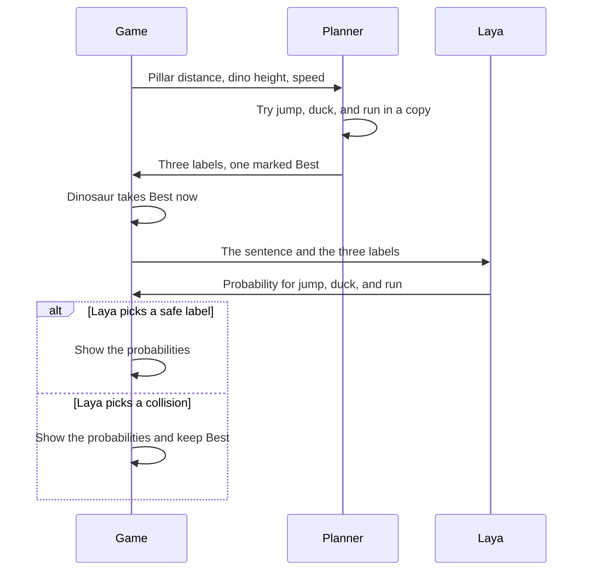

# Dino Jump

A small runner in the style of the browser dinosaur game. The page runs the physics. A planner writes the current situation in English, and Laya English scores `jump`, `duck`, or `run`.

https://github.com/user-attachments/assets/28d08ae4-b4dd-45b5-9366-bfff3666d1f0

## How a frame works

Laya does not see the canvas. Each frame has two parts: the planner moves the dinosaur, and, about 11 times a second, Laya reads the sentence the planner just wrote.

1. The game starts and the dinosaur runs. Laya English is loaded once, on this Mac.
2. Every frame, ordinary code reads the positions. It tries the jump in a private copy of the game and finds the last moment a jump still clears the next pillar. It writes three labels and marks one of them `Best`. The dinosaur does that move immediately.
3. About every 90 ms, that same text is sent to Laya. The question is fixed: pick `jump`, `duck`, or `run`. Laya returns a probability for each label. The bars on the page are those numbers.

If Laya picks the safe label, the note says so. If it picks a label marked as a collision, the dinosaur still does `Best`, and the shield count goes up. Then step 2 runs on the next frame.



One sentence the planner can write:

```text
Dino runner game. One cactus ahead, 146 px away.
Recommended action: run.

jump: Too early. A jump now lands on the obstacle.
duck: Collision. Hits the obstacle.
run: Safe. Stay down and jump later. Best.
```

The checked option, "Tell Laya which moves are safe", includes those Safe / Collision / Best lines. Turn it off and Laya receives only the distance and the obstacle name. The dinosaur still follows the planner.

## Run

The English MLX weights already cached on this Mac are used. No download is required.

```bash
virtualvenv venv
source venv/bin/active
pip install -r requirements.txt
python server.py
```

Open http://127.0.0.1:8876

Space or the up arrow jumps. The down arrow ducks. "Play yourself" ignores the planner and the model.

## Check

`GET /health` returns `ready: true` after the weights load. The first load takes a few seconds. Each later decision is one local forward pass.
